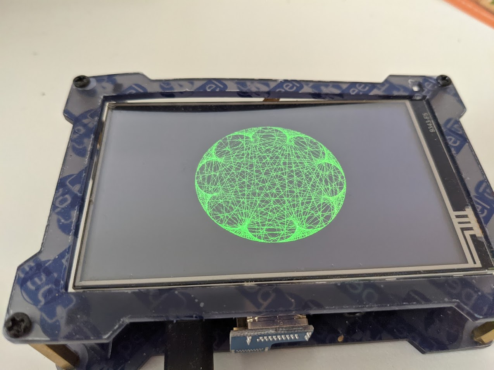

### Animating [Time Tables](https://www.youtube.com/watch?v=qhbuKbxJsk8) with the Kernel DRM Submodule.

This is an example of how to use libdrm in Linux. It setups access to the screen with the Kernel Direct Rendering Module in order to manipulate the screen buffer. The code also includes Bresenham-Algorithm to Rasterize lines and circles and implements simple double buffering to avoid flickering.

